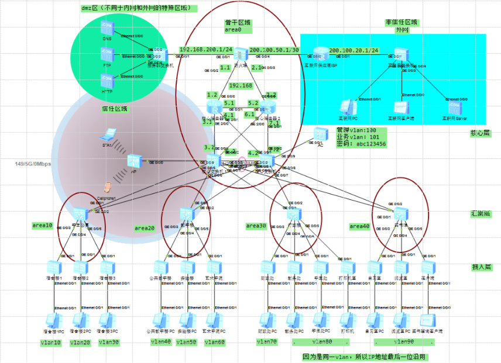
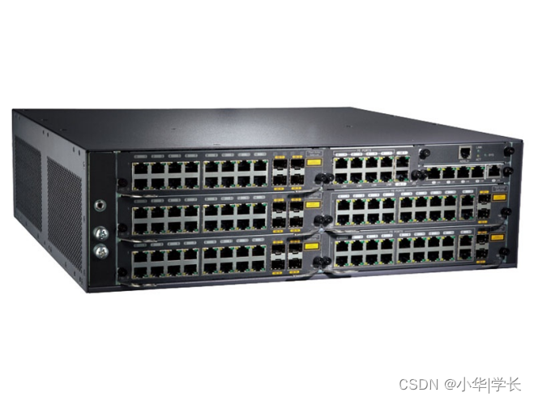
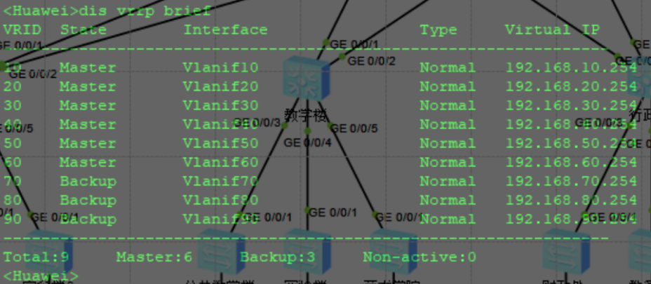

# 校园网规划与设计实训（基于华为 eNSP）

> 本文基于《计算机网络实践》集中实训整理，完整记录一个中型校园网从需求分析、三层架构设计、VLAN/IP 规划、设备选型，到防火墙 / OSPF / VRRP / MSTP / DHCP / NAT / 无线 AC 的全流程配置与验证。实验环境为华为 eNSP 模拟器。

---

## 一、项目概述

校园网是面向教学、科研、行政办公的综合性园区网络，具有**规模大、用户多、结构复杂、业务类型多样**的特点。本次设计以"实用、够用、好用、安全"为指导思想，以"标准化、先进性、可靠性、安全性"为原则，搭建一套具备以下能力的校园网络：

- 内外网访问控制与安全隔离；
- 教学楼、宿舍楼、行政楼、图书馆等区域的逻辑隔离；
- 核心层设备冗余，单点故障不影响业务；
- 无线网络全覆盖；
- DMZ 区部署 DNS / FTP / HTTP 服务器，对外提供服务。

---

## 二、网络需求分析

| 需求维度 | 具体要求 |
| :--- | :--- |
| 访问控制 | 过滤进出流量，只允许符合安全策略的报文通过 |
| 安全审计 | 监视用户行为，告警可能的攻击，对机密文件分级保护 |
| 带宽管理 | 防止学生终端滥用带宽，保障关键应用 |
| 接入层 | 支持安全控制、端口隔离、防攻击，千兆到桌面 |
| 核心层 | 高可靠、高吞吐，满足接入层汇聚后的线速转发 |
| 无线覆盖 | 教学楼、图书馆等区域无线全覆盖，需授权才能接入 |
| 服务器区 | 部署 DNS / FTP / Web，对外提供服务 |

---

## 三、网络拓扑与三层架构

校园网采用经典的**三层架构**：接入层 → 汇聚层 → 核心层，出口为防火墙，旁挂 DMZ 服务器区。



### 3.1 接入层

- 负责终端 PC、AP 的接入；
- 按楼栋划分端口，配置 Access 端口划入对应 VLAN；
- 上行到汇聚层使用 Trunk。

### 3.2 汇聚层

- 汇聚本楼栋所有接入交换机的流量；
- 配置 VLANIF 网关地址（采用 `.251`），承担本楼栋的三层转发；
- 上行到核心层使用 Eth-Trunk 链路聚合，实现冗余与带宽叠加。

### 3.3 核心层

- 双核心交换机（CSW1 / CSW2），通过 VRRP 实现网关冗余；
- 强交换、弱路由，完成 VLAN 间高速转发；
- 通过 OSPF 与出口路由器、防火墙联动；
- 旁挂 AC 控制器，管理无线 AP。

### 3.4 出口与 DMZ

- 出口部署华为 USG5150 防火墙，划分为 Local / Trust / Untrust / DMZ 四个安全区域；
- DMZ 区部署 DNS、FTP、HTTP 三台服务器，通过 NAT Server 映射到公网；
- 内网通过 Easy-IP 方式访问互联网。

---

## 四、VLAN 与 IP 地址规划

IP 地址按"网段 = VLAN ID"的规则分配：`192.168.<VLAN_ID>.0/24`，便于记忆与排障。

| 区域 | OSPF Area | 位置 | VLAN | 网关 / 地址 |
| :--- | :--- | :--- | :--- | :--- |
| 学生公寓 | Area 10 | 宿舍楼 1 | VLAN 10 | DHCP 分配 |
| 学生公寓 | Area 10 | 宿舍楼 2 | VLAN 20 | DHCP 分配 |
| 学生公寓 | Area 10 | 宿舍楼 3 | VLAN 30 | DHCP 分配 |
| 教学楼 | Area 20 | 实验楼 | VLAN 40 | 192.168.40.1 |
| 教学楼 | Area 20 | 公共教学楼 | VLAN 50 | 192.168.50.1 |
| 教学楼 | Area 20 | 艺术楼 | VLAN 60 | 192.168.60.1 |
| 行政楼 | Area 30 | 财务 | VLAN 70 | 192.168.70.1 |
| 行政楼 | Area 30 | 教务 | VLAN 80 | 192.168.80.1 |
| 图书馆 | Area 40 | 自习室 | VLAN 90 | 192.168.90.1 |
| 无线 | — | AC 管理 | VLAN 100 | 192.168.100.254 |
| 无线 | — | 用户业务 | VLAN 101 | 192.168.101.254 |
| DMZ | Area 0 | 服务器区 | — | 192.168.200.0/24 |
| 外网 | — | ISP | — | 200.100.50.0 / 200.100.20.0 |

**地址约定：**

- 汇聚层 VLANIF 地址：`192.168.<vlan>.251/24`；
- 核心层 VRRP 虚网关：`192.168.<vlan>.254/24`；
- 核心交换机 1 实地址：`192.168.<vlan>.252/24`；
- 核心交换机 2 实地址：`192.168.<vlan>.253/24`。

---

## 五、设备选型



| 设备 | 型号 | 主要参数 | 数量 |
| :--- | :--- | :--- | :--- |
| 核心交换机 | 华为 Quidway S9306 | 背板 6Tbps，转发 1152Mpps，双主控双电源，支持 AC 卡 | 1 |
| 汇聚交换机 | 华为 S5700-28C-EI-24S | 24 千兆光口 + 4 千兆电口，三层，支持 OSPF/堆叠 | 6 |
| 接入交换机 | 华为 S2700-EI(AC) | 24 百兆口 + 2 千兆 combo，支持 VLAN/端口限速/Radius | 13 |
| 防火墙 | 华为 USG5150 | 吞吐量 4Gbps，并发 200 万，4GE Combo，含 IPS/防病毒 | 1 |

---

## 六、关键技术配置详解

### 6.1 VLAN 与端口类型

- 交换机之间链路（同设备或跨设备互联）使用 **Trunk**，放行所需 VLAN；
- 交换机接终端 PC 使用 **Access**，划入对应业务 VLAN；
- 交换机接路由器 / 防火墙（不同三层设备）使用 **Access**，用三层接口互联。

```text
vlan batch 10 20 30 40 50 60 70 80 90 100 to 101
```

### 6.2 DHCP 自动分配

学生公寓区域（VLAN 10/20/30）地址由汇聚交换机通过 DHCP 全局地址池自动分配，其他区域使用静态地址。

```text
ip pool 10
 gateway-list 192.168.10.254
 network 192.168.10.0 mask 255.255.255.0
 dns-list 192.168.200.10
!
interface Vlanif10
 ip address 192.168.10.251 255.255.255.0
 dhcp select global
```

### 6.3 Eth-Trunk 链路聚合

两台核心交换机之间、核心与汇聚之间使用 Eth-Trunk 将多条物理链路捆绑为一条逻辑链路，既增加带宽又提供冗余。

```text
interface Eth-Trunk1
 port link-type trunk
 port trunk allow-pass vlan 2 to 4094
!
interface GigabitEthernet0/0/3
 eth-trunk 1
interface GigabitEthernet0/0/4
 eth-trunk 1
```

### 6.4 VRRP 网关冗余

在双核心交换机上为每个 VLAN 配置 VRRP 组，虚拟 IP 作为终端网关。通过优先级实现负载分担：

- **CSW1**：VLAN 10–60 优先级 120（Master），VLAN 70–90 优先级默认 100（Backup）；
- **CSW2**：VLAN 10–60 优先级默认 100（Backup），VLAN 70–90 优先级 120（Master）。

这样学生公寓 + 教学楼流量走 CSW1，行政楼 + 图书馆流量走 CSW2，两台核心设备均摊负载，且任一设备宕机时另一台自动接管全部 VLAN。

```text
interface Vlanif10
 ip address 192.168.10.252 255.255.255.0
 vrrp vrid 10 virtual-ip 192.168.10.254
 vrrp vrid 10 priority 120
```

`display vrrp brief` 验证结果：



### 6.5 MSTP 多实例生成树

为避免二层环路并实现 VLAN 级负载分担，配置 MSTP：

- 实例 1：映射 VLAN 10–60，CSW1 为主根；
- 实例 2：映射 VLAN 70–90，CSW2 为主根。

```text
stp region-configuration
 region-name 1
 revision-level 1
 instance 1 vlan 10 20 30 40 50 60
 instance 2 vlan 70 80 90
 active region-configuration
!
stp instance 1 root primary
stp instance 2 root secondary
```

### 6.6 OSPF 动态路由（Stub 区域）

OSPF 区域规划：

- **Area 0（骨干）**：核心交换机、核心路由器、防火墙之间；
- **Area 10**：学生公寓；
- **Area 20**：教学楼；
- **Area 30**：行政楼；
- **Area 40**：图书馆。

每个非骨干区域配置为 **Totally Stub 区域**（`stub no-summary`），阻挡 LSA Type 3/4/5，减少汇聚和接入设备的路由表规模，只通过默认路由访问其他区域。

```text
ospf 1
 area 0.0.0.0
  network 192.168.3.0 0.0.0.255
  network 192.168.6.0 0.0.0.255
 area 0.0.0.10
  network 192.168.10.0 0.0.0.255
  network 192.168.20.0 0.0.0.255
  network 192.168.30.0 0.0.0.255
  stub no-summary
```

防火墙一侧通过默认路由 `ip route-static 0.0.0.0 0.0.0.0 200.100.50.2` 指向 ISP，并将默认路由注入 OSPF，使内网所有网段都能访问外网。

### 6.7 防火墙安全区域与策略

防火墙接口按安全级别划分区域：

| 区域 | 优先级 | 接口 | 用途 |
| :--- | :--- | :--- | :--- |
| Local | 100 | — | 防火墙自身 |
| Trust | 85 | GE0/0/0、GE0/0/2、GE0/0/3 | 内网核心、汇聚 |
| DMZ | 50 | GE0/0/1 | 服务器区 |
| Untrust | 5 | GE0/0/4 | 互联网 |

区域间策略默认全部拒绝，实验中先放通：

```text
policy interzone trust untrust outbound
 policy 10
  action permit
policy interzone trust dmz outbound
 policy 10
  action permit
policy interzone dmz untrust inbound
 policy 10
  action permit
```

### 6.8 NAT 地址转换

- **内网访问外网**：使用 Easy-IP，直接借用出接口公网地址做源 NAT；
- **外网访问 DMZ 服务器**：使用 NAT Server 将公网地址的 80/21 端口映射到 DMZ 内网服务器。

```text
nat-policy interzone trust untrust outbound
 policy 10
  action source-nat
  policy source 192.168.0.0 0.0.255.255
  easy-ip GigabitEthernet0/0/4
!
nat server 0 protocol tcp global 200.100.50.1 www inside 192.168.200.30 www
nat server 1 protocol tcp global 200.100.50.1 ftp inside 192.168.200.20 ftp
```

### 6.9 无线 AC 配置

AC 通过 VLANIF100 建立 CAPWAP 隧道管理 AP，AP 获取 VLAN101 地址，用户业务流量走 VLAN101：

```text
capwap source interface vlanif100
ip pool ap
 network 192.168.101.0 mask 255.255.255.0
 gateway-list 192.168.101.254
!
wlan
 ssid-profile name ssid
  ssid CampusNet
 security-profile sec
  security wpa2 psk pass-phrase abc123456
 vap-profile name vap
  forward-mode tunnel
  service-vlan vlan-id 101
  ssid-profile ssid
  security-profile sec
 ap-group name group-ap
  vap-profile vap wlan 1 radio all
```

---

## 七、完整设备配置代码

### 7.1 防火墙（USG5150）

```text
sysname FW
#
stp region-configuration
 active region-configuration
#
interface GigabitEthernet0/0/0
 ip address 192.168.0.1 255.255.255.0
 dhcp select interface
 dhcp server gateway-list 192.168.0.1
#
interface GigabitEthernet0/0/1
 ip address 192.168.200.1 255.255.255.0
#
interface GigabitEthernet0/0/2
 ip address 192.168.1.1 255.255.255.0
#
interface GigabitEthernet0/0/3
 ip address 192.168.2.1 255.255.255.0
#
interface GigabitEthernet0/0/4
 ip address 200.100.50.1 255.255.255.252
#
firewall zone local
 set priority 100
#
firewall zone trust
 set priority 85
 add interface GigabitEthernet0/0/0
 add interface GigabitEthernet0/0/2
 add interface GigabitEthernet0/0/3
#
firewall zone untrust
 set priority 5
 add interface GigabitEthernet0/0/4
#
firewall zone dmz
 set priority 50
 add interface GigabitEthernet0/0/1
#
ospf 1
 area 0.0.0.0
  network 192.168.1.0 0.0.0.255
  network 192.168.2.0 0.0.0.255
  network 192.168.200.0 0.0.0.255
#
ip route-static 0.0.0.0 0.0.0.0 200.100.50.2
#
policy interzone trust untrust outbound
 policy 10
  action permit
policy interzone trust dmz outbound
 policy 10
  action permit
policy interzone dmz untrust inbound
 policy 10
  action permit
#
nat-policy interzone trust untrust outbound
 policy 10
  action source-nat
  policy source 192.168.0.0 0.0.255.255
  easy-ip GigabitEthernet0/0/4
#
nat server 0 protocol tcp global 200.100.50.1 www inside 192.168.200.30 www
nat server 1 protocol tcp global 200.100.50.1 ftp inside 192.168.200.20 ftp
```

### 7.2 核心路由器

```text
# R1
interface GigabitEthernet0/0/0
 ip address 192.168.1.2 255.255.255.0
interface GigabitEthernet0/0/1
 ip address 192.168.5.1 255.255.255.0
interface GigabitEthernet2/0/0
 ip address 192.168.3.1 255.255.255.0
interface GigabitEthernet2/0/1
 ip address 192.168.4.1 255.255.255.0
ospf 1
 area 0.0.0.0
  network 0.0.0.0 255.255.255.255

# R2
interface GigabitEthernet0/0/0
 ip address 192.168.2.2 255.255.255.0
interface GigabitEthernet0/0/1
 ip address 192.168.5.2 255.255.255.0
interface GigabitEthernet2/0/0
 ip address 192.168.6.1 255.255.255.0
interface GigabitEthernet2/0/1
 ip address 192.168.7.1 255.255.255.0
ospf 1
 area 0.0.0.0
  network 0.0.0.0 255.255.255.255
```

### 7.3 核心交换机 CSW1（VLAN 10–60 为主）

```text
sysname CSW1
vlan batch 3 6 10 20 30 40 50 60 70 80
vlan batch 90 100 to 101
#
stp region-configuration
 region-name 1
 revision-level 1
 instance 1 vlan 10 20 30 40 50 60
 instance 2 vlan 70 80 90
 active region-configuration
stp instance 1 root primary
stp instance 2 root secondary
#
interface Vlanif3
 ip address 192.168.3.2 255.255.255.0
interface Vlanif6
 ip address 192.168.6.2 255.255.255.0
#
# VLAN 10-60：优先级 120，作为 Master
interface Vlanif10
 ip address 192.168.10.252 255.255.255.0
 vrrp vrid 10 virtual-ip 192.168.10.254
 vrrp vrid 10 priority 120
# VLAN 70-90：优先级默认 100，作为 Backup
interface Vlanif70
 ip address 192.168.70.252 255.255.255.0
 vrrp vrid 70 virtual-ip 192.168.70.254
#
interface Vlanif100
 ip address 192.168.100.254 255.255.255.0
interface Vlanif101
 ip address 192.168.101.254 255.255.255.0
#
interface Eth-Trunk1
 port link-type trunk
 port trunk allow-pass vlan 2 to 4094
#
interface GigabitEthernet0/0/1
 port link-type access
 port default vlan 3
interface GigabitEthernet0/0/2
 port link-type access
 port default vlan 6
interface GigabitEthernet0/0/3
 eth-trunk 1
interface GigabitEthernet0/0/4
 eth-trunk 1
interface GigabitEthernet0/0/5
 port link-type trunk
 port trunk allow-pass vlan 2 to 4094
interface GigabitEthernet0/0/6
 port link-type trunk
 port trunk allow-pass vlan 2 to 4094
interface GigabitEthernet0/0/7
 port link-type trunk
 port trunk allow-pass vlan 2 to 4094
interface GigabitEthernet0/0/8
 port link-type trunk
 port trunk allow-pass vlan 2 to 4094
interface GigabitEthernet0/0/9
 port link-type access
 port default vlan 101
#
ospf 1
 area 0.0.0.0
  network 192.168.3.0 0.0.0.255
  network 192.168.6.0 0.0.0.255
  network 192.168.100.0 0.0.0.255
  network 192.168.101.0 0.0.0.255
 area 0.0.0.10
  network 192.168.10.0 0.0.0.255
  network 192.168.20.0 0.0.0.255
  network 192.168.30.0 0.0.0.255
  stub no-summary
 area 0.0.0.20
  network 192.168.40.0 0.0.0.255
  network 192.168.50.0 0.0.0.255
  network 192.168.60.0 0.0.0.255
  stub no-summary
 area 0.0.0.30
  network 192.168.70.0 0.0.0.255
  network 192.168.80.0 0.0.0.255
  stub no-summary
 area 0.0.0.40
  network 192.168.90.0 0.0.0.255
  stub no-summary
```

### 7.4 核心交换机 CSW2（VLAN 70–90 为主）

与 CSW1 基本对称，主要差异：

- 互联 VLAN 为 4、7；
- VLAN 10–60 实地址 `.253`，优先级默认 100；
- VLAN 70–90 实地址 `.253`，优先级 120；
- MSTP 中 instance 1 为 secondary，instance 2 为 primary。

```text
vlan batch 4 7 10 20 30 40 50 60 70 80
vlan batch 90 100 to 101
stp region-configuration
 region-name 1
 revision-level 1
 instance 1 vlan 10 20 30 40 50 60
 instance 2 vlan 70 80 90
 active region-configuration
stp instance 1 root secondary
stp instance 2 root primary
#
interface Vlanif4
 ip address 192.168.4.2 255.255.255.0
interface Vlanif7
 ip address 192.168.7.2 255.255.255.0
#
interface Vlanif10
 ip address 192.168.10.253 255.255.255.0
 vrrp vrid 10 virtual-ip 192.168.10.254
#
interface Vlanif70
 ip address 192.168.70.253 255.255.255.0
 vrrp vrid 70 virtual-ip 192.168.70.254
 vrrp vrid 70 priority 120
#
interface Vlanif100
 ip address 192.168.100.253 255.255.255.0
interface Vlanif101
 ip address 192.168.101.253 255.255.255.0
#
interface Eth-Trunk1
 port link-type trunk
 port trunk allow-pass vlan 2 to 4094
#
interface GigabitEthernet0/0/1
 port link-type access
 port default vlan 7
interface GigabitEthernet0/0/2
 port link-type access
 port default vlan 4
interface GigabitEthernet0/0/3
 eth-trunk 1
interface GigabitEthernet0/0/4
 eth-trunk 1
#
ospf 1
 area 0.0.0.0
  network 192.168.4.0 0.0.0.255
  network 192.168.7.0 0.0.0.255
  network 192.168.100.0 0.0.0.255
  network 192.168.101.0 0.0.0.255
 area 0.0.0.10
  network 192.168.10.0 0.0.0.255
  network 192.168.20.0 0.0.0.255
  network 192.168.30.0 0.0.0.255
  stub no-summary
 area 0.0.0.20
  network 192.168.40.0 0.0.0.255
  network 192.168.50.0 0.0.0.255
  network 192.168.60.0 0.0.0.255
  stub no-summary
 area 0.0.0.30
  network 192.168.80.0 0.0.0.255
  network 192.168.70.0 0.0.0.255
  stub no-summary
 area 0.0.0.40
  network 192.168.90.0 0.0.0.255
  stub no-summary
```

### 7.5 无线 AC

```text
vlan batch 100 to 101
#
interface Vlanif100
 ip address 192.168.100.1 255.255.255.0
interface Vlanif101
 ip address 192.168.101.1 255.255.255.0
#
interface GigabitEthernet0/0/1
 port link-type trunk
 port trunk allow-pass vlan 2 to 4094
#
ip route-static 192.168.0.0 255.255.0.0 192.168.100.253
#
capwap source interface vlanif100
#
ip pool ap
 network 192.168.101.0 mask 255.255.255.0
 gateway-list 192.168.101.254
#
interface Vlanif101
 dhcp select global
#
wlan
 ssid-profile name ssid
  ssid CampusNet
 security-profile sec
  security wpa2 psk pass-phrase abc123456
 vap-profile name vap
  forward-mode tunnel
  service-vlan vlan-id 101
  ssid-profile ssid
  security-profile sec
 ap-group name group-ap
  vap-profile vap wlan 1 radio all
 ap-id 1 ap-mac 00e0-fcdb-2e60
  ap-group group-ap
```

### 7.6 汇聚交换机（以学生公寓为例）

```text
vlan batch 10 20 30 40 50 60 70 80 90 100 to 101
stp region-configuration
 region-name 1
 revision-level 1
 instance 1 vlan 10 20 30 40 50 60
 instance 2 vlan 70 80 90
 active region-configuration
#
ip pool 10
 gateway-list 192.168.10.254
 network 192.168.10.0 mask 255.255.255.0
 dns-list 192.168.200.10
ip pool 20
 gateway-list 192.168.20.254
 network 192.168.20.0 mask 255.255.255.0
 dns-list 192.168.200.10
ip pool 30
 gateway-list 192.168.30.254
 network 192.168.30.0 mask 255.255.255.0
 dns-list 192.168.200.10
#
interface Vlanif10
 ip address 192.168.10.251 255.255.255.0
 dhcp select global
interface Vlanif20
 ip address 192.168.20.251 255.255.255.0
 dhcp select global
interface Vlanif30
 ip address 192.168.30.251 255.255.255.0
 dhcp select global
#
interface GigabitEthernet0/0/1
 port link-type trunk
 port trunk allow-pass vlan 2 to 4094
#
ospf 1
 area 0.0.0.10
  network 192.168.10.0 0.0.0.255
  network 192.168.20.0 0.0.0.255
  network 192.168.30.0 0.0.0.255
  stub no-summary
```

教学楼（Area 20）、行政楼（Area 30）、图书馆（Area 40）汇聚交换机结构相同，仅替换对应 VLAN 与 Area 编号。

### 7.7 接入交换机（以宿舍 1 为例）

```text
vlan batch 10
interface Ethernet0/0/1
 port link-type access
 port default vlan 10
interface GigabitEthernet0/0/1
 port link-type trunk
 port trunk allow-pass vlan 2 to 4094
```

### 7.8 ISP

```text
interface GigabitEthernet0/0/0
 ip address 200.100.50.2 255.255.255.252
interface GigabitEthernet0/0/1
 ip address 200.100.20.254 255.255.255.0
```

---

## 八、测试验证

| 测试项 | 方法 | 预期结果 |
| :--- | :--- | :--- |
| VRRP 冗余 | 关闭 CSW1，查看 CSW2 的 `display vrrp brief` | CSW2 自动成为 VLAN 10–60 的 Master，业务不中断 |
| 内网连通性 | 不同 VLAN 的 PC 互 ping | 全部通 |
| DHCP | 宿舍 PC 自动获取地址 | 获取到 `192.168.<vlan>.x` |
| 内网访问外网 | 内网 PC ping 200.100.20.1 | 通过 NAT 通 |
| 外网访问内网 | 外网 PC ping 内网服务器地址 | 默认不通（符合安全策略） |
| DMZ 服务 | 内网 / 外网访问 `http://200.100.50.1` | 成功打开 Web 页面 |
| 无线接入 | 连接 SSID `CampusNet` | 获取 VLAN101 地址，可访问内网 |

---

## 九、实训中遇到的问题与解决

| 问题 | 原因 | 解决方式 |
| :--- | :--- | :--- |
| 部分服务无法访问 | 防火墙 ACL 规则顺序错误 | 调整规则顺序，优先放行关键服务 |
| OSPF 区域间路由不通 | 区域划分错误 / 接口网络类型不匹配 | 重新核对 Area 编号与接口宣告网段 |
| MSTP 根桥选举异常 | 交换机优先级与实例映射配置错误 | 修正 `stp instance x root primary/secondary` |
| VRRP 切换不生效 | 两台设备 VRRP 组号不一致 | 保证 `vrrp vrid` 在同 VLAN 下两端一致 |

---

## 十、总结

通过本次校园网规划实训，把网络原理课程中的 VLAN、Trunk、Eth-Trunk、VRRP、MSTP、OSPF、DHCP、NAT、防火墙安全区域等知识点串联成了一个完整可运行的项目。核心收获：

1. **层次化设计思想**：接入 / 汇聚 / 核心分工明确，核心层"强交换弱路由"；
2. **冗余与负载分担**：VRRP + MSTP + Eth-Trunk 三者配合，既消除单点故障又充分利用带宽；
3. **OSPF Stub 区域**：有效控制路由表规模，适合接入层设备性能有限的场景；
4. **安全边界清晰**：防火墙 Trust / DMZ / Untrust 区域划分 + NAT Server，内网、DMZ、外网三者互访可控。

> 实验环境：华为 eNSP，设备包括 S5700/S3700 交换机、AR2220 路由器、USG5150 防火墙、AC6005。
