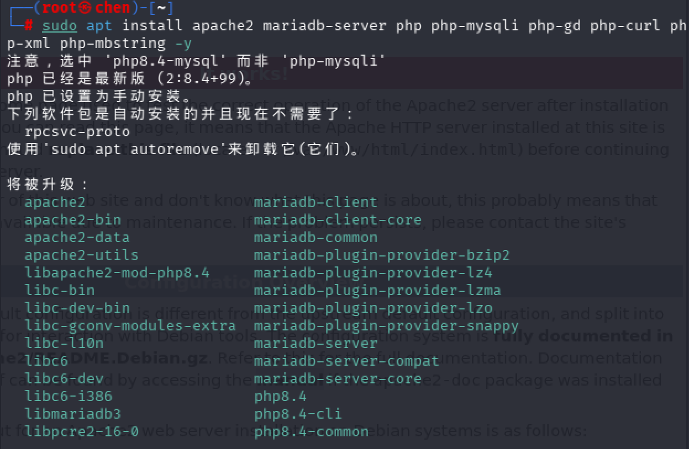
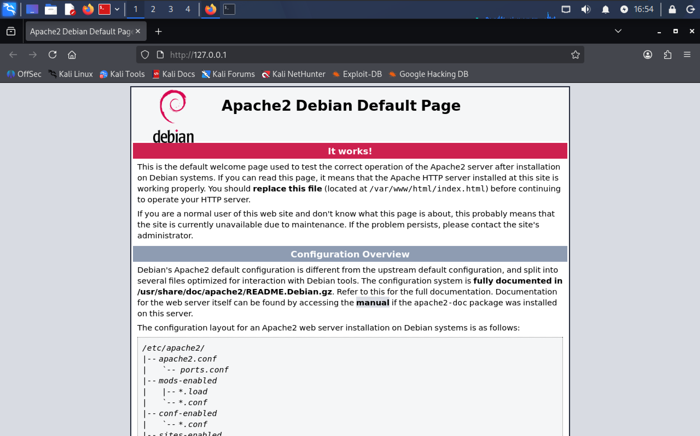
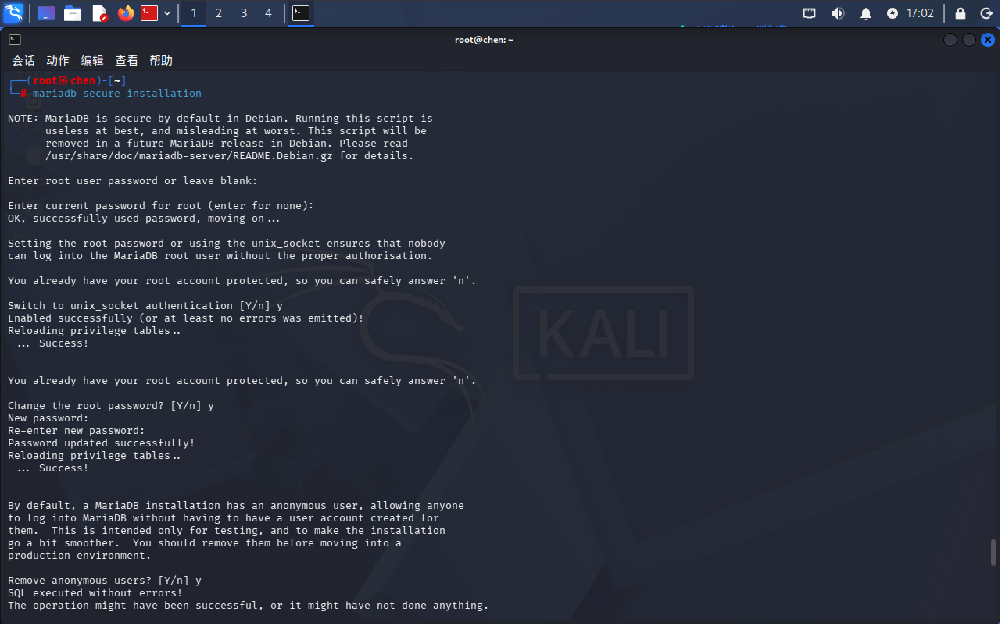
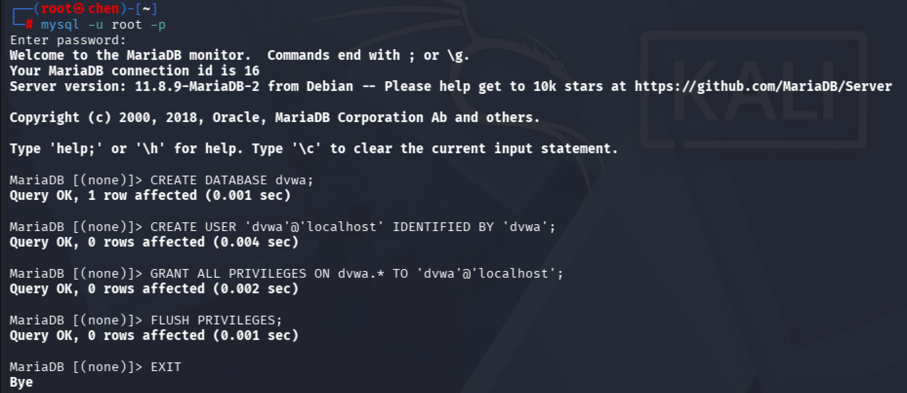
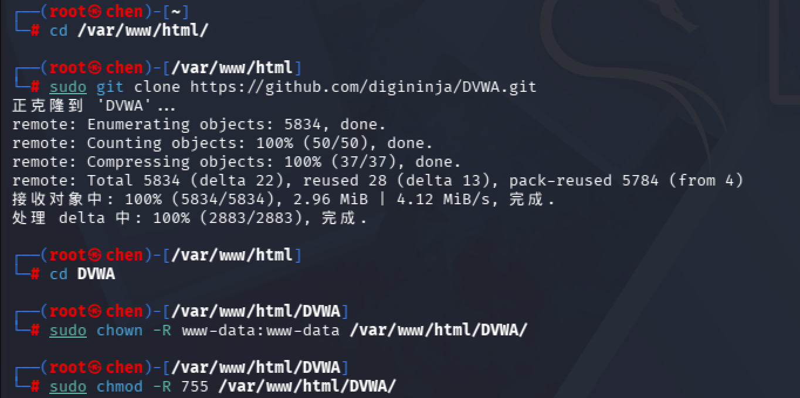
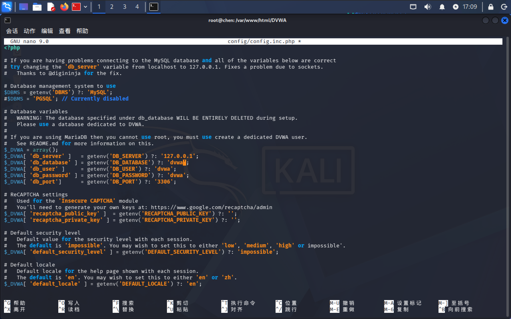
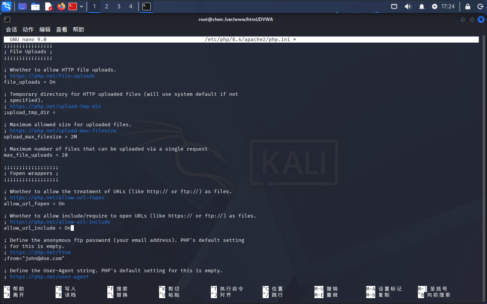
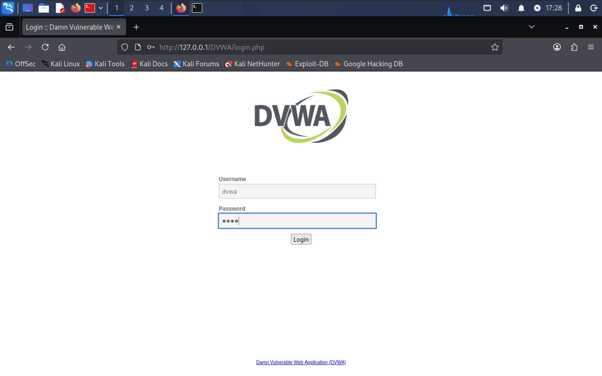
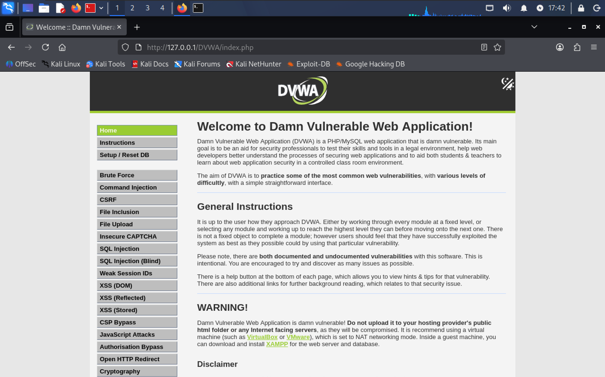

# DVWA 本地搭建笔记（Kali Linux）

> **DVWA**（Damn Vulnerable Web Application）是一个用 PHP + MySQL 编写的、故意做得不安全的 Web 应用，专门用来练习 Web 安全漏洞（SQL 注入、XSS、文件上传、文件包含、命令注入等）。
>
> 本仓库记录在 **Kali Linux** 上从零搭建 DVWA 的完整过程，每一步都有实际操作截图，供自己复盘和新手参考。

---

## 环境信息

| 项目 | 版本 / 说明 |
|------|------------|
| 操作系统 | Kali Linux（Rolling 版本） |
| Web 服务器 | Apache 2 |
| 数据库 | MariaDB 11.8.9 |
| 后端语言 | PHP 8.4 |
| DVWA 版本 | 官方最新版（GitHub 仓库） |

---

## 一、安装 LAMP 环境

LAMP = Linux + Apache + MariaDB + PHP，是运行 DVWA 所需的整套环境。

```bash
sudo apt update
sudo apt install apache2 mariadb-server php php-mysqli php-gd php-curl php-xml php-mbstring -y
```

> **注意**：Kali 最新版默认 PHP 8.4，安装时选中的是 `php8.4-mysql` 而非 `php-mysqli`，系统会自动处理，不用手动改。

安装完成后启动服务并设置开机自启：

```bash
sudo systemctl start apache2
sudo systemctl start mariadb
sudo systemctl enable apache2
sudo systemctl enable mariadb
```



---

## 二、验证 Apache 是否正常

打开浏览器访问 `http://127.0.0.1`，看到 **Apache2 Debian Default Page** 并显示 "It works!"，说明 Apache 启动成功。



---

## 三、初始化数据库安全配置

运行 MariaDB 安全初始化脚本，提升数据库安全性：

```bash
sudo mysql_secure_installation
```

交互过程按如下选择：

| 提示 | 选择 | 说明 |
|------|------|------|
| Enter current password for root | 直接回车 | 默认无密码 |
| Switch to unix_socket authentication | y | 启用 socket 认证 |
| Change the root password? | y | 设置 root 密码 |
| Remove anonymous users? | y | 删除匿名用户 |
| Disallow root login remotely? | y | 禁止 root 远程登录 |
| Remove test database? | y | 删除测试库 |
| Reload privilege tables? | y | 刷新权限生效 |



---

## 四、创建 DVWA 数据库和用户

登录 MySQL：

```bash
mysql -u root -p
```

输入上一步设置的 root 密码后，依次执行以下 SQL：

```sql
-- 1. 创建 DVWA 数据库
CREATE DATABASE dvwa;

-- 2. 创建 DVWA 专用用户（用户名 dvwa，密码 dvwa）
CREATE USER 'dvwa'@'localhost' IDENTIFIED BY 'dvwa';

-- 3. 授权 dvwa 用户管理 dvwa 数据库
GRANT ALL PRIVILEGES ON dvwa.* TO 'dvwa'@'localhost';

-- 4. 刷新权限
FLUSH PRIVILEGES;

-- 5. 退出
EXIT;
```



---

## 五、下载 DVWA 源码

```bash
# 进入 Web 根目录
cd /var/www/html/

# 从 GitHub 克隆 DVWA
sudo git clone https://github.com/digininja/DVWA.git

# 进入 DVWA 目录
cd DVWA

# 修改目录权限，让 Apache 能读写上传文件
sudo chown -R www-data:www-data /var/www/html/DVWA/
sudo chmod -R 755 /var/www/html/DVWA/
```



---

## 六、配置 DVWA 数据库连接

```bash
# 复制示例配置文件
sudo cp config/config.inc.php.dist config/config.inc.php

# 编辑配置文件
sudo nano config/config.inc.php
```

确认以下配置项与第四步设置的数据库信息一致：

```php
$_DVWA[ 'db_server' ]    = '127.0.0.1';
$_DVWA[ 'db_database' ]  = 'dvwa';
$_DVWA[ 'db_user' ]      = 'dvwa';
$_DVWA[ 'db_password' ]  = 'dvwa';
$_DVWA[ 'db_port' ]      = '3306';
```

> 保存：`Ctrl + O` → 回车
> 退出：`Ctrl + X`



---

## 七、修改 PHP 配置

DVWA 需要开启 `allow_url_include` 和 `allow_url_fopen` 才能正常运行文件包含漏洞模块。

```bash
# 编辑 PHP 配置文件（注意 PHP 版本号，用 php -v 查看）
sudo nano /etc/php/8.4/apache2/php.ini
```

找到并修改以下两项：

```ini
allow_url_fopen = On
allow_url_include = On
```

保存后重启 Apache：

```bash
sudo systemctl restart apache2
```



---

## 八、浏览器访问并初始化

打开浏览器访问：`http://127.0.0.1/DVWA/`

首次访问会跳转到 Setup 页面，拉到最底部点击 **Create / Reset Database**，等待几秒后自动跳转到登录页。

输入默认账号密码：

- 用户名：`admin`
- 密码：`password`



登录成功后看到 DVWA 首页，显示 "Welcome to Damn Vulnerable Web Application!"，左侧菜单列出所有漏洞模块，说明搭建完成！



---

## 九、常见问题排查

| 问题现象 | 可能原因 | 解决方法 |
|---------|---------|---------|
| Database failed | 数据库密码不对 / MariaDB 没启动 | 检查 config.inc.php 密码；`sudo systemctl start mariadb` |
| allow_url_include 红色警告 | PHP 配置没改 | 修改 php.ini 后重启 apache2 |
| 文件上传失败 | 目录权限不对 | `sudo chown -R www-data:www-data /var/www/html/DVWA/` |
| 403 Forbidden | Apache 没启动 / 目录权限不对 | `sudo systemctl start apache2`；权限改为 755 |
| 页面打不开 | Apache 没启动 / 端口被占 | `sudo systemctl status apache2` 查看状态 |

---

## 参考链接

- DVWA 官方仓库：https://github.com/digininja/DVWA
- PortSwigger Web Security Academy：https://portswigger.net/web-security
- 先知社区：https://xz.aliyun.com

---

> **警告**：DVWA 是故意设计成不安全的应用，**切勿部署到公网服务器**，仅用于本地虚拟机练习。
